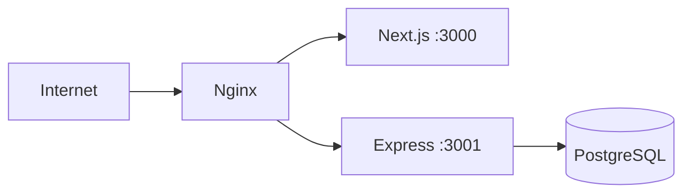

# 部署说明文档（DEPLOYMENT）

## 1. 环境依赖清单

- Node.js `>= 18.0.0`
- npm `>= 9.0.0`
- PostgreSQL `>= 16`（推荐 Docker 方式）
- 操作系统：Linux/macOS（Windows 可通过 WSL）

---

## 2. 数据库安装和配置

## 2.1 使用 Docker（推荐）

项目根目录已提供 `docker-compose.yml`。

启动数据库：

```bash
npm run db:up
```

停止数据库：

```bash
npm run db:down
```

重置数据库（清空数据卷）：

```bash
npm run db:reset
```

## 2.2 环境变量配置

复制配置模板：

```bash
cp .env.example .env
```

关键变量：

- `POSTGRES_USER`
- `POSTGRES_PASSWORD`
- `POSTGRES_DB`
- `POSTGRES_HOST`
- `POSTGRES_PORT`
- `SERVER_PORT`
- `NEXT_PUBLIC_API_URL`

---

## 3. 项目安装步骤

在项目根目录执行：

1. 安装依赖

```bash
npm install
```

1. 启动 PostgreSQL

```bash
npm run db:up
```

1. 初始化数据库结构（迁移）

```bash
npm run db:migrate --workspace=apps/server
```

---

## 4. 数据库初始化和 CSV 数据导入

## 4.1 默认导入

默认读取路径：`data/app_roi_data.csv`

```bash
npm run data:import
```

## 4.2 指定 CSV 路径（可选）

```bash
npm run data:import --workspace=apps/server -- /absolute/path/to/your.csv

```

说明：

- 导入使用 upsert，重复 `(stat_date, app_id, country)` 会覆盖更新。
- 导入完成会写入 `import_metadata`，用于后续 `roi_status` 计算。

---

## 5. 项目启动方式

## 5.1 开发环境

一键同时启动前后端：

```bash
npm run dev
```

访问地址：

- 前端：`http://localhost:3000`
- 后端：`http://localhost:3001`
- 健康检查：`http://localhost:3001/health`

## 5.2 生产构建与启动

1. 构建

```bash
npm run build
```

1. 启动后端

```bash
npm run start --workspace=apps/server
```

1. 启动前端

```bash
npm run start --workspace=apps/web
```

---

## 6. 生产环境配置

## 6.1 建议的部署拓扑




建议：

- 用 Nginx 统一入口并配置 HTTPS
- 通过 PM2/Systemd 守护 `apps/web` 与 `apps/server` 进程
- 数据库限制公网访问，仅内网可达

## 6.2 环境变量建议（生产）

- `NODE_ENV=production`
- `CORS_ORIGIN` 设置为实际前端域名（避免通配）
- `NEXT_PUBLIC_API_URL` 设置为生产 API 地址（或由网关内转发）
- 使用强密码替换默认 `POSTGRES_PASSWORD`

## 6.3 安全与稳定性建议

- 定期备份数据库（全量 + binlog/WAL 策略）
- 启用日志轮转，避免磁盘被日志占满
- 配置健康检查和自动重启
- 为导入接口增加鉴权（生产必做）

---

## 7. 验证清单（上线前）

- `npm install` 成功
- PostgreSQL 正常启动并可连接
- 迁移脚本执行成功
- CSV 成功导入，`import_metadata` 有最新记录
- `/health` 返回 `status=ok`
- `/api/roi` 返回有效数据
- 前端页面可正常展示图表与上传弹窗

---

## 8. 常见部署问题

- **数据库连接超时**：检查 `POSTGRES_HOST/PORT` 与容器状态
- **前端请求 404/跨域失败**：检查 `NEXT_PUBLIC_API_URL` 与 `CORS_ORIGIN`
- **图表无数据**：确认已导入 CSV 且筛选条件有匹配记录
- **迁移失败**：确认数据库账号权限（建表、建索引、插入）

