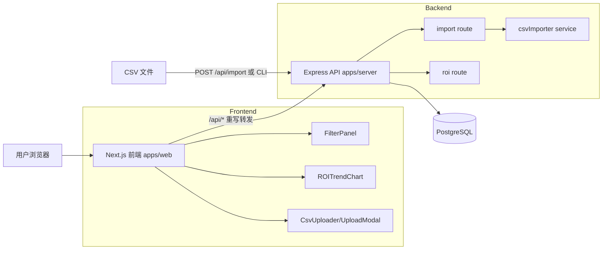
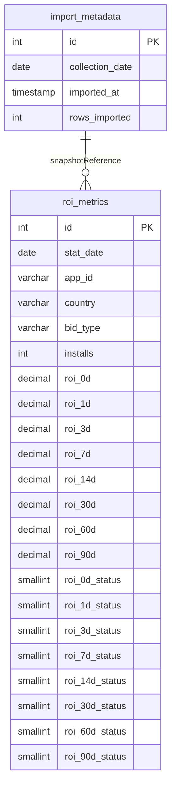
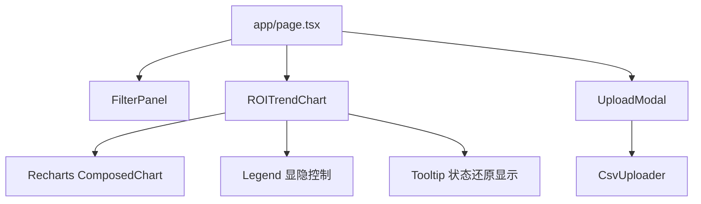
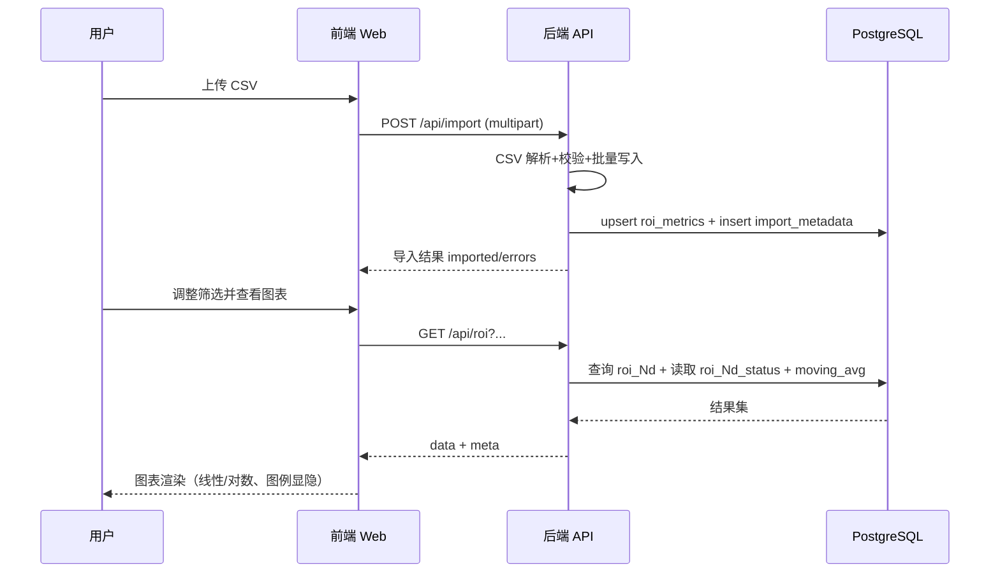

# jian系统设计文档（DESIGN）

## 1. 设计目标与范围

Ad-ROI 的目标是把原始广告 CSV 数据转为可筛选、可视化、可用于投放决策的 ROI 趋势系统，重点解决：

- 多 ROI 周期（0d/1d/3d/7d/14d/30d/60d/90d）统一查询
- 区分真实 0 值与“日期不足导致的 0 显示”
- 大量时间序列数据的平滑展示（移动平均）
- 前后端低耦合、便于扩展周期和筛选维度

---

## 2. 系统整体架构图




说明：

- 前端通过 `next.config.mjs` 将 `/api/:path*` 代理到后端。
- 后端统一接收查询与上传请求，读写 PostgreSQL。
- CSV 可通过页面上传或 CLI 导入。

---

## 3. 数据结构设计

### 3.1 数据库表结构

#### `import_metadata`

用于记录每次导入快照日期（`collection_date`）与导入规模

字段定义（详细）：


| 字段名               | 类型          | 约束                       | 说明                   |
| ----------------- | ----------- | ------------------------ | -------------------- |
| `id`              | `SERIAL`    | `PK`                     | 导入记录主键               |
| `collection_date` | `DATE`      | `NOT NULL`               | 本次 CSV 的数据截止日期（快照日期） |
| `imported_at`     | `TIMESTAMP` | `NOT NULL DEFAULT NOW()` | 实际导入执行时间             |
| `rows_imported`   | `INTEGER`   | 可空                       | 本次导入成功写入行数           |


使用说明：

- 读取接口默认使用“最近一次导入”（`ORDER BY id DESC LIMIT 1`）对应的 `collection_date` 作为业务元信息返回。
- 导入流程会先写 `roi_metrics`，再写 `import_metadata`，两者处于同一事务内。

#### `roi_metrics`

核心事实表，按 `(stat_date, app_id, country)` 去重。

字段定义（详细）：


| 字段名                     | 类型              | 约束                   | 说明                    |
| ----------------------- | --------------- | -------------------- | --------------------- |
| `id`                    | `SERIAL`        | `PK`                 | 事实表主键                 |
| `stat_date`             | `DATE`          | `NOT NULL`           | 投放统计日期                |
| `app_id`                | `VARCHAR(50)`   | `NOT NULL`           | 应用标识                  |
| `country`               | `VARCHAR(10)`   | `NOT NULL`           | 国家地区（如 US/UK）         |
| `bid_type`              | `VARCHAR(20)`   | `NOT NULL`           | 出价类型（当前为 CPI）         |
| `installs`              | `INTEGER`       | `NOT NULL DEFAULT 0` | 安装量                   |
| `roi_0d`                | `DECIMAL(10,4)` | 可空                   | 当日 ROI（小数存储，1.0=100%） |
| `roi_1d`                | `DECIMAL(10,4)` | 可空                   | 1 日 ROI               |
| `roi_3d`                | `DECIMAL(10,4)` | 可空                   | 3 日 ROI               |
| `roi_7d`                | `DECIMAL(10,4)` | 可空                   | 7 日 ROI               |
| `roi_14d`               | `DECIMAL(10,4)` | 可空                   | 14 日 ROI              |
| `roi_30d`               | `DECIMAL(10,4)` | 可空                   | 30 日 ROI              |
| `roi_60d`               | `DECIMAL(10,4)` | 可空                   | 60 日 ROI              |
| `roi_90d`               | `DECIMAL(10,4)` | 可空                   | 90 日 ROI              |
| `roi_0d_status`         | `SMALLINT`      | `NOT NULL DEFAULT 1` | 0d 状态码（1=valid,2=pending,3=zero） |
| `roi_1d_status`         | `SMALLINT`      | `NOT NULL DEFAULT 1` | 1d 状态码（1=valid,2=pending,3=zero） |
| `roi_3d_status`         | `SMALLINT`      | `NOT NULL DEFAULT 1` | 3d 状态码（1=valid,2=pending,3=zero） |
| `roi_7d_status`         | `SMALLINT`      | `NOT NULL DEFAULT 1` | 7d 状态码（1=valid,2=pending,3=zero） |
| `roi_14d_status`        | `SMALLINT`      | `NOT NULL DEFAULT 1` | 14d 状态码（1=valid,2=pending,3=zero） |
| `roi_30d_status`        | `SMALLINT`      | `NOT NULL DEFAULT 1` | 30d 状态码（1=valid,2=pending,3=zero） |
| `roi_60d_status`        | `SMALLINT`      | `NOT NULL DEFAULT 1` | 60d 状态码（1=valid,2=pending,3=zero） |
| `roi_90d_status`        | `SMALLINT`      | `NOT NULL DEFAULT 1` | 90d 状态码（1=valid,2=pending,3=zero） |


约束与索引：

- 唯一约束：`UNIQUE (stat_date, app_id, country)`
- 查询索引：`idx_roi_filter (app_id, country, stat_date)`

状态字段说明（当前实现）：

- 每个周期独立状态列：`roi_Nd_status`
- 状态码含义：
  - `1`：Valid（周期成熟且 ROI 非 0）
  - `2`：Pending（`stat_date + period_days > collection_date`，日期不足）
  - `3`：Zero（周期成熟但 ROI = 0 或空值）

### 3.2 ER 图




说明：

- 逻辑上 `import_metadata` 与 `roi_metrics` 存在“快照参考关系”，但当前**不建物理外键**（历史行不绑定单次导入批次）。
- 业务计算以“最新快照”为准：`import_metadata` 的最新 `collection_date` 在导入阶段参与 `roi_Nd_status` 计算。

---

## 4. 关键业务规则

### 4.1 ROI 状态判定（当前实现：独立状态列）

采用每周期独立状态列方案：`roi_0d_status` ~ `roi_90d_status`。

查询某一 `roi_period` 时，直接读取对应状态列：

- `roi_status = 2` -> `roi_reason = insufficient_date`（日期不足）
- `roi_status = 3` -> `roi_reason = real_zero`（真实 0）
- `roi_status = 1` -> `roi_reason = valid`（有效值）

该规则确保“日期不足的 0 显示”和“真实 0 收益”可被准确区分。

### 4.2 移动平均

查询端使用窗口函数：

- `AVG(roi_Nd) OVER (PARTITION BY app_id, country ORDER BY stat_date ROWS BETWEEN ma_days-1 PRECEDING AND CURRENT ROW)`

默认 `ma_days = 7`，前端展示趋势时更平滑。

---

## 5. API 接口设计规范

## 5.1 通用规范

- 基础路径：`/api`
- 返回格式：`application/json`
- 错误码：
  - `400` 参数校验失败/上传格式问题
  - `500` 服务内部错误

### 5.2 `GET /api/roi`

用途：查询 ROI 趋势数据。

请求参数（Query）：

- `app_id`：应用列表（当前支持 App-1~App-5）
- `country`：国家列表（US/UK）
- `start_date` / `end_date`：日期范围（`YYYY-MM-DD`）
- `roi_period`：`0d|1d|3d|7d|14d|30d|60d|90d`
- `ma_days`：移动平均窗口（1~30，默认 7）

响应字段说明（核心）：

- `roi_status`：当前 `roi_period` 对应状态码（1/2/3）
- `roi_reason`：状态语义（`valid | insufficient_date | real_zero`）

响应示例（简化）：

```json
{
  "data": [
    {
      "stat_date": "2025-06-01",
      "app_id": "App-1",
      "country": "US",
      "installs": 1200,
      "roi_7d": 0.83,
      "roi_value": 0.83,
      "roi_status": 1,
      "roi_reason": "valid",
      "moving_avg": 0.79
    }
  ],
  "meta": {
    "collection_date": "2025-07-13"
  }
}
```

### 5.3 `POST /api/import`

用途：上传 CSV 并导入数据库。

- Content-Type：`multipart/form-data`
- 文件字段名：`file`
- 限制：最大 50MB，仅 CSV
- 可选字段：`collection_date`

响应示例（简化）：

```json
{
  "imported": 3200,
  "collection_date": "2025-07-13",
  "errors": []
}
```

---

## 6. 前端组件层次结构




职责说明：

- `FilterPanel`：筛选条件选择（App/国家/出价/显示模式/Y 轴刻度）
- `useROI`：拼接 query 参数并请求 `/api/roi`
- `ROITrendChart`：多周期折线、100% 基准线、log/linear 切换、图例点击显隐，并基于 `roi_status/roi_reason` 处理“日期不足”提示
- `UploadModal + CsvUploader`：CSV 拖拽/点击上传及结果反馈

---

## 7. 数据流向图（CSV 导入→数据库→API→前端）




---

## 8. 非功能设计

- 可维护性：迁移脚本 + schema 常量统一
- 可扩展性：
  - 当前：每个周期一组 ROI 列 + 状态列，查询直观、实现简单
  - 代价：新增周期需要同步修改表结构、导入逻辑、查询字段
- 性能：
  - 批量写入（按批处理）
  - 复合索引加速筛选
  - CTE + 窗口函数一次查询完成聚合
- 安全性：
  - 后端参数校验（Zod）
  - 上传文件类型和大小限制

---

## 9. 现状与可演进方向

- 生产部署可补充 Nginx、进程守护（PM2/Systemd）与监控告警。
- 当前状态建模采用独立状态列（`roi_0d_status` ~ `roi_90d_status`），可读性高、便于前后端直接消费。
- 方案建议（未落地）：可将“日期不足”压缩为 `roi_insufficient_mask`（bitmask）以减少字段数量；需同步改造导入与查询解码逻辑。
- 未来若 ROI 周期需要频繁新增/调整，建议重构为长表模型（`period_days`, `roi_value`, `status`）：
  - 优点：新增周期无需变更表结构，仅新增数据
  - 优点：周期维度统计与扩展能力更强
  - 代价：查询与聚合 SQL 更复杂，需要重新设计索引策略

