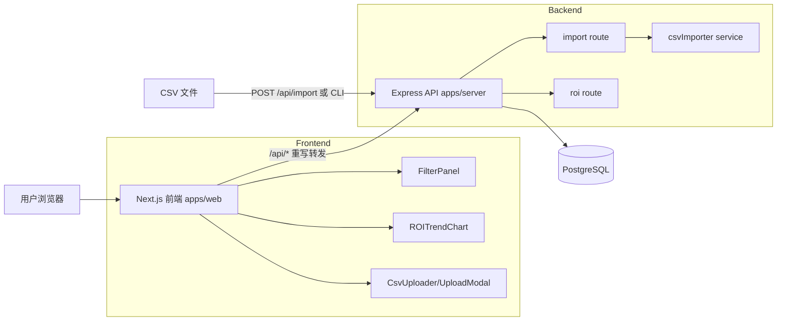
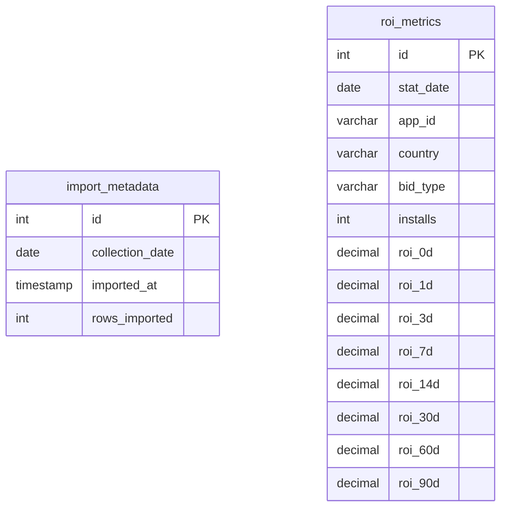
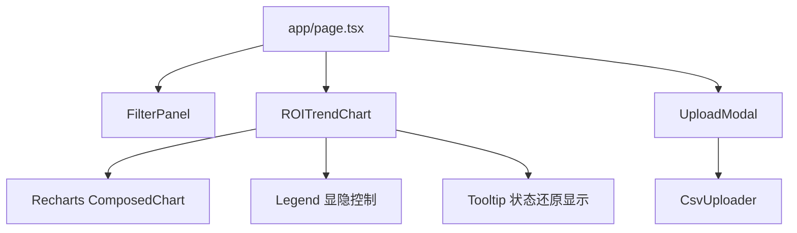
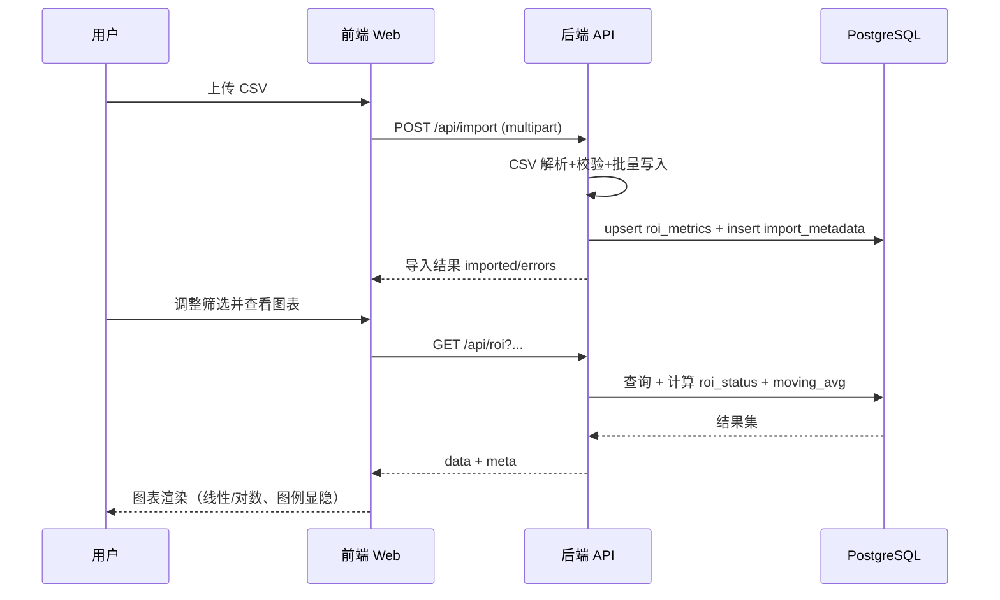

# 系统设计文档（DESIGN）

## 1. 设计目标与范围

Ad-ROI 的目标是把原始广告 CSV 数据转为可筛选、可视化、可用于投放决策的 ROI 趋势系统，重点解决：

- 多 ROI 周期（0d/1d/3d/7d/14d/30d/60d/90d）统一查询
- 数据未成熟（Pending）与真实 0 值（Zero）区分
- 大量时间序列数据的平滑展示（移动平均）
- 前后端低耦合、便于扩展周期和筛选维度

---

## 2. 系统整体架构图




说明：

- 前端通过 `next.config.mjs` 将 `/api/:path*` 代理到后端。
- 后端统一接收查询与上传请求，读写 PostgreSQL。
- CSV 可通过页面上传或 CLI 导入。

---

## 3. 数据结构设计

### 3.1 数据库表结构

#### `import_metadata`

用于记录每次导入快照日期（`collection_date`）与导入规模，支撑 ROI 状态计算。

字段：

- `id`：主键
- `collection_date`：数据采集快照日期
- `imported_at`：导入执行时间
- `rows_imported`：本次导入记录数

#### `roi_metrics`

核心事实表，按 `(stat_date, app_id, country)` 去重。

字段（核心）：

- 维度：`stat_date`, `app_id`, `country`, `bid_type`
- 规模：`installs`
- 指标：`roi_0d` ~ `roi_90d`
- 唯一约束：`UNIQUE (stat_date, app_id, country)`
- 索引：`(app_id, country, stat_date)` 用于查询加速

### 3.2 ER 图




说明：当前没有外键关联，`import_metadata` 作为全局最新快照来源参与状态计算。

---

## 4. 关键业务规则

### 4.1 ROI 状态 `roi_status`（查询时计算，不落库）

- `1` = Valid：周期已成熟，且 ROI 为有效值
- `2` = Pending：`stat_date + 周期天数 > collection_date`，说明统计周期未结束
- `3` = Zero：周期已成熟但 ROI 为 0（或空值按 0 处理）

该规则保证“暂未成熟的数据 0 值”和“真实 0 收益”不会混淆。

### 4.2 移动平均

查询端使用窗口函数：

- `AVG(roi_Nd) OVER (PARTITION BY app_id, country ORDER BY stat_date ROWS BETWEEN ma_days-1 PRECEDING AND CURRENT ROW)`

默认 `ma_days = 7`，前端展示趋势时更平滑。

---

## 5. API 接口设计规范

## 5.1 通用规范

- 基础路径：`/api`
- 返回格式：`application/json`
- 错误码：
  - `400` 参数校验失败/上传格式问题
  - `500` 服务内部错误

### 5.2 `GET /api/roi`

用途：查询 ROI 趋势数据。

请求参数（Query）：

- `app_id`：应用列表（当前支持 App-1~App-5）
- `country`：国家列表（US/UK）
- `start_date` / `end_date`：日期范围（`YYYY-MM-DD`）
- `roi_period`：`0d|1d|3d|7d|14d|30d|60d|90d`
- `ma_days`：移动平均窗口（1~30，默认 7）

响应示例（简化）：

```json
{
  "data": [
    {
      "stat_date": "2025-06-01",
      "app_id": "App-1",
      "country": "US",
      "installs": 1200,
      "roi_7d": 0.83,
      "roi_value": 0.83,
      "roi_status": 1,
      "moving_avg": 0.79
    }
  ],
  "meta": {
    "collection_date": "2025-07-13"
  }
}
```

### 5.3 `POST /api/import`

用途：上传 CSV 并导入数据库。

- Content-Type：`multipart/form-data`
- 文件字段名：`file`
- 限制：最大 50MB，仅 CSV
- 可选字段：`collection_date`

响应示例（简化）：

```json
{
  "imported": 3200,
  "collection_date": "2025-07-13",
  "errors": []
}
```

---

## 6. 前端组件层次结构




职责说明：

- `FilterPanel`：筛选条件选择（App/国家/出价/显示模式/Y 轴刻度）
- `useROI`：拼接 query 参数并请求 `/api/roi`
- `ROITrendChart`：多周期折线、100% 基准线、log/linear 切换、图例点击显隐
- `UploadModal + CsvUploader`：CSV 拖拽/点击上传及结果反馈

---

## 7. 数据流向图（CSV 导入→数据库→API→前端）




---

## 8. 非功能设计

- 可维护性：迁移脚本 + schema 常量统一
- 可扩展性：ROI 周期通过列命名规则扩展，状态规则集中在后端
- 性能：
  - 批量写入（按批处理）
  - 复合索引加速筛选
  - CTE + 窗口函数一次查询完成聚合
- 安全性：
  - 后端参数校验（Zod）
  - 上传文件类型和大小限制

---

## 9. 现状与可演进方向

- 生产部署可补充 Nginx、进程守护（PM2/Systemd）与监控告警。

